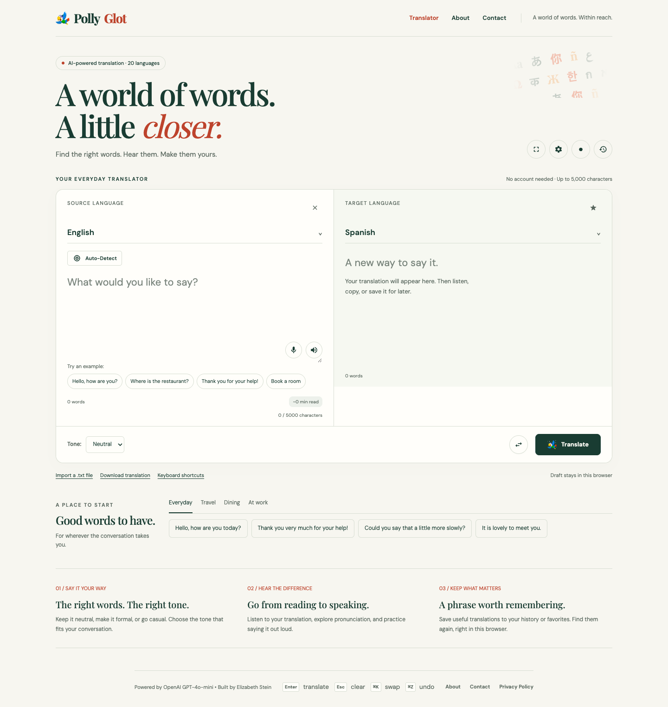
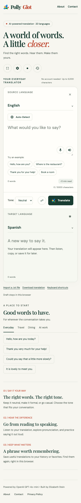
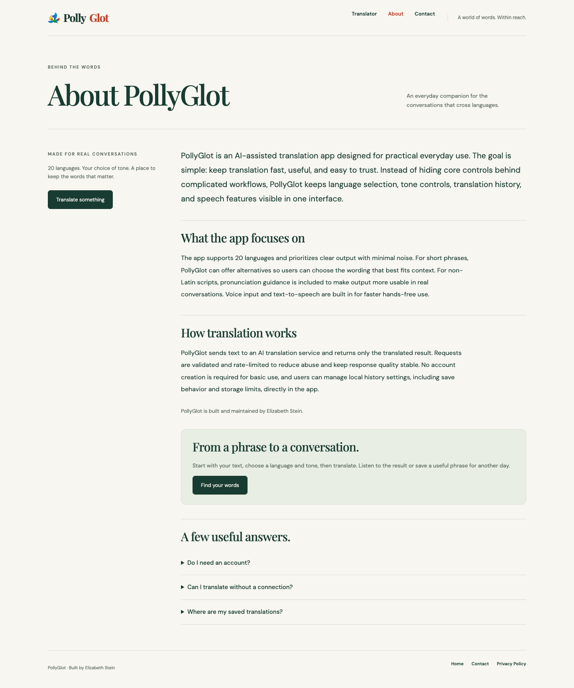
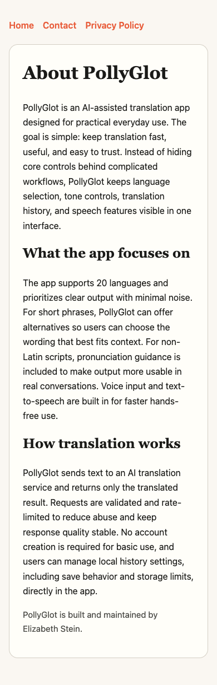
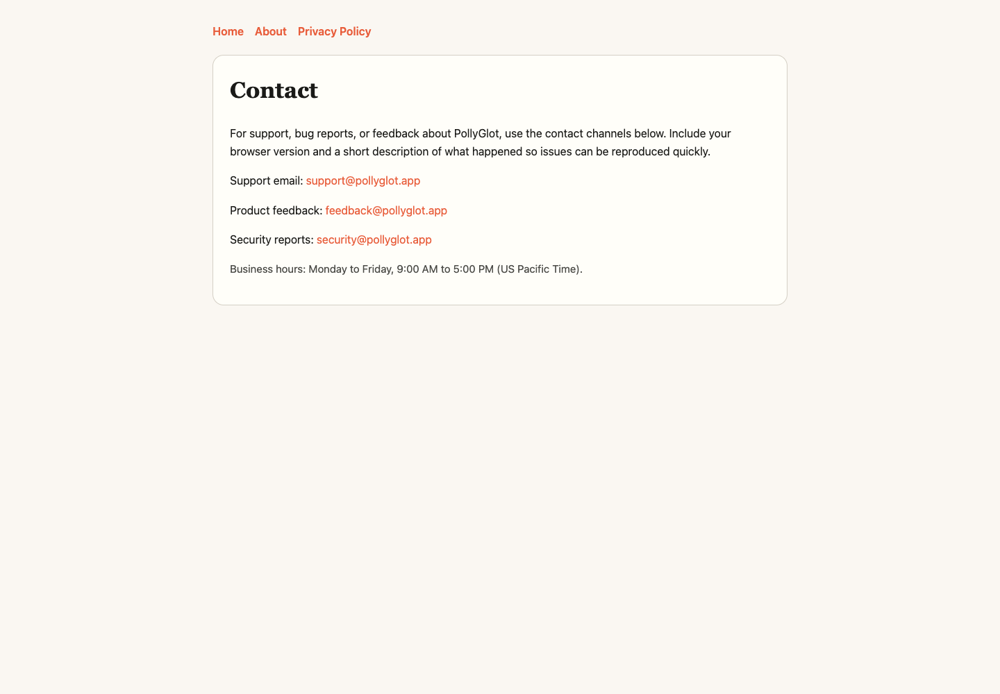
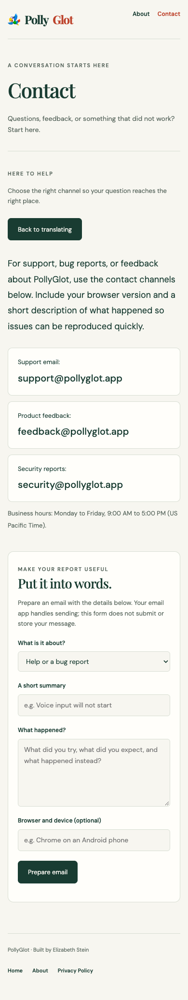
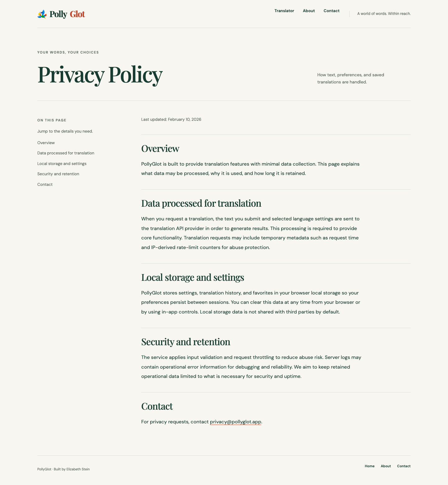
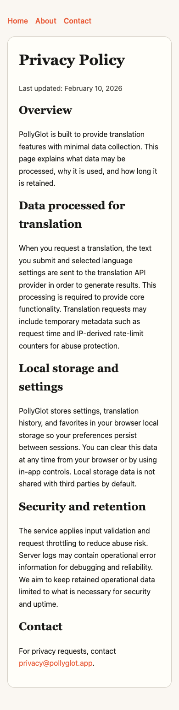

# PollyGlot upgrade report

October 9, 2026 · branch **design/upgrade** · baseline **b999453**. Seven phases completed, committed separately. No merge, push, deployment, new paid service, API key, database change, route change or file/content deletion performed. Pre-existing untracked `.env.example` and `CLAUDE.md` remain untouched.

## Result and design rationale

All four page templates now share an editorial paper/forest system: Playfair Display headlines, DM Sans UI, ruled panels, restrained coral accents and the existing parrot identity. Exemplar/Tengile informed typography, Tekt the warm palette, Mintlify the readable utility controls, Terms the task-focused composition and Paste the saved-content workflow. A translation tool needs readable input and clear states more than decorative motion; reduced motion and dark mode are supported.

The homepage replaces the obstructive language grids with compact searchable menus and a responsive workspace. On mobile the Translate/tone/swap row sits immediately after the source input, before the result. About provides a readable explanation and practical FAQ, Contact prepares useful reports in the visitor's email app, and Privacy provides clear section navigation without changing the policy substance.

Research: **13 live design references**, including more than four outside translation, and **nine usable category peers**. Every cited live destination was loaded and screenshotted in Chrome. Blocked galleries/candidates and research limits are recorded in [references.md](references.md) and [features.md](features.md). No authenticated or paid feature inventory is claimed to be exhaustive.

## Before / after — every template

All images are real Chrome screenshots driven by Playwright, desktop 1440×1000 and mobile 390×844, captured full-page. Baselines use underlying HTML routes; final page navigation also passed on existing extensionless routes. Full capture records are `before-captures.json` and `after-captures.json`.

### Translator

| View | Before | After |
|---|---|---|
| Desktop | [Open before](screenshots/before/home-desktop.png) | [Open after](screenshots/after/home-desktop.png) |
| Mobile | [Open before](screenshots/before/home-mobile.png) | [Open after](screenshots/after/home-mobile.png) |

### About

| View | Before | After |
|---|---|---|
| Desktop | [Open before](screenshots/before/about-desktop.png) | [Open after](screenshots/after/about-desktop.png) |
| Mobile | [Open before](screenshots/before/about-mobile.png) | [Open after](screenshots/after/about-mobile.png) |

### Contact

| View | Before | After |
|---|---|---|
| Desktop | [Open before](screenshots/before/contact-desktop.png) | [Open after](screenshots/after/contact-desktop.png) |
| Mobile | [Open before](screenshots/before/contact-mobile.png) | [Open after](screenshots/after/contact-mobile.png) |

### Privacy Policy

| View | Before | After |
|---|---|---|
| Desktop | [Open before](screenshots/before/privacy-policy-desktop.png) | [Open after](screenshots/after/privacy-policy-desktop.png) |
| Mobile | [Open before](screenshots/before/privacy-policy-mobile.png) | [Open after](screenshots/after/privacy-policy-mobile.png) |

## Features added or improved

1. Compact source/target language search, no-match states, selection announcements and reliable language-pair restoration. All 20 languages retained.
2. Persistent loading/error/success feedback, retry, duplicate-request guard and rejection of responses when input/pair/tone changed during translation.
3. Local draft recovery with browser-storage failure feedback; existing PWA shared text is accepted.
4. Everyday/travel/dining/work phrase starters; original examples retained.
5. Search across local history and favorites, including full source/result text.
6. Local `.txt` import with file/size/character limits and translation text download; no upload service added.
7. Offline notice, shortcut reference, modal focus handling, keyboard-operable alternative phrasings, and accessible control names/contrast.
8. Shared navigation/footer and responsive system across every page, with inherited dark theme.
9. About guide/FAQ and clear return-to-translation links.
10. Contact composer with required-field validation, correctly encoded mailto, preparation feedback and reset on edit. It prepares a message; the visitor reviews and sends it in their email app.
11. Privacy contents anchors and clearer reading layout. All original policy paragraphs/date and contact details remain.
12. Updated v3 app cache includes the new shared assets. History CSV export now keeps its dialog open.

Original speech, practice, tone, history, favorites, share, fullscreen, settings, examples and shortcuts remain available. No existing feature was intentionally removed. Provider-dependent functions are subject to the testing limits below.

## Rubric scores

Internal screenshot assessment on a 1–5 scale; not an external award, comparative benchmark or user study.

| Template | Point of view | Type | Layout/rhythm | Color/imagery | Motion | Audience fit | Memorable | Craft |
|---|---:|---:|---:|---:|---:|---:|---:|---:|
| Home | 4 | 4 | 4 | 4 | 4 | 4 | 4 | 4 |
| About | 4 | 4 | 4 | 4 | 4 | 4 | 4 | 4 |
| Contact | 4 | 4 | 4 | 4 | 4 | 4 | 4 | 4 |
| Privacy | 4 | 4 | 4 | 4 | 4 | 4 | 4 | 4 |

Home had two required screenshot/score/fix rounds before rollout. Round one exposed inherited flex/overflow problems; round two exposed heading flow/sidebar bounds. Both were fixed before the final review. About's first rollout review found an invisible CTA label; it was fixed and recaptured. Final mobile review improved action order. All details and intermediate captures are in [scores.md](scores.md). Motion is restrained for a reading utility; accessible feedback is the criterion.

## Verification

- **59 Playwright Chrome checks passed**, zero unhandled browser errors. Core simulated translation/retry, clipboard, keyboard alternative selection, swap/undo, text/CSV download, history/favorites search, drafts/imports, dialogs, navigation and contact/privacy journeys passed. API responses were mocked; no paid requests made.
- **11 axe states clean** for automated WCAG A/AA checks, including language menu, settings, empty history, home light/dark and every supporting page light/dark.
- **Four pages load offline** from the real v3 service-worker app cache. This does not enable offline AI translation.
- Existing Vitest suite: **2/2 passed**. It is a small sample suite; browser checks provide the change-specific coverage.
- JS syntax and whitespace checks passed. Build/typecheck/lint have no configured scripts or applicable frontend pipeline; no unrelated Next build was run.
- All **15 original supporting-page paragraphs** preserved; no missing paragraphs. Original policy date, addresses and hours retained.

| Mobile Lighthouse | Performance | Accessibility | Best practices | SEO |
|---|---:|---:|---:|---:|
| Home | 96 | 100 | 100 | 92 |
| About | 100 | 100 | 100 | 92 |
| Contact | 100 | 100 | 100 | 92 |
| Privacy | 100 | 100 | 100 | 92 |

Lighthouse 12.6.1, local preview, simulated mobile throttling. Home LCP 2.6s, CLS .001; supporting pages LCP 1.5s and CLS below .001. The first redesigned-home audit scored 85 performance/96 accessibility; reserving picker space and fixing control contrast/names raised that to 96/100. This is a redesign-iteration comparison, not an original-site baseline or a production measurement. Existing relative canonicals account for SEO 92; the authoritative domain must be confirmed before changing them.

Full evidence: [verification.md](verification.md), `browser-results.json`, `accessibility-results.json`, `pwa-results.json`, `content-preservation.json`, `lighthouse-summary.json` and the complete Lighthouse JSON reports. Loading/error/success/dark screenshots are under `screenshots/after/` alongside contact's prepared-message state.

## Blocked or untested

Every static template is done and tested on desktop/mobile Chrome. No template is marked done without a real browser capture. Remaining limits:

- Real translation accuracy, live detection/alternatives/pronunciation/TTS fallback providers, API rate limiting and email delivery were not exercised.
- Real microphone permission/recording, pronunciation scoring, OS sharing/email handlers, cross-platform fullscreen, mobile PWA installation, other browsers/devices and manual screen-reader use remain untested.
- Existing production v2 → v3 service-worker upgrade was not tested; fresh v3 offline caching was.
- The checkout began 18 commits behind origin/main. Those commits were not pulled or merged, so reconciliation is needed before any deployment.
- Blocked research candidates and gallery access details remain in the research documents. No inferred features are attributed to blocked pages.

## Full approval list

No risky actions performed. These items are deferred:

- Pulling/merging the 18 newer commits on origin/main, merging this branch, deployment or production changes.
- Deleting files/content/features, removing unused dependencies, changing public URLs or Vercel rewrites.
- Accounts, cloud-synced phrasebooks, CMS/database work or migrations.
- Image/document translation requiring a new OCR/file-processing service, additional paid services or API keys; any new live paid API requests during QA.
- Selecting/confirming the production canonical domain and replacing existing relative canonical/OG URLs (SEO remains 92 in the local audit).
- Changing privacy policy substance or retention claims, verified mailbox/business-hours claims, or adding unsupported accuracy/security/customer claims.

Existing functionality and routes will be preserved. New local UI features do not require a database.

## Phase commits

| Phase | Commit | Purpose |
|---|---|---|
| 1 | 45e8c83 | Repo profile and browser baseline |
| 2 | 6d9f086 | Live reference and competitor research |
| 3 | f3d1530 | One design direction and ranked plan |
| 4 | d3d1814 | Foundation, home and local features |
| 5 | aa38c2d | Every supporting page and contact flow |
| 6 | eabf960 | Accessibility, mobile refinement and verification |
| 7 | This report's commit | Final report and completed progress |

Work stops here. Branch remains unmerged and undeployed.

## Functionality continuation

After the seven-phase upgrade, the user authorized additional feature/functionality work. Added cancellation and timeout recovery; corrected outdated-result actions, late responses, typing after Clear, draft/language persistence, swap/undo and saved-entry restoration. **14 new functionality tests and the original 59 browser checks pass**, plus 2/2 repository tests. New state screenshots and remaining priorities are in [functionality.md](functionality.md). No live paid providers, production changes or deployment were used.

## Final merge review — October 9

User authorized fixing and merging ready work after the original seven-phase stop. PR #75: https://github.com/forbiddenlink/pollyglot/pull/75. Upstream security/tooling commits retained. Final review corrected Clear → Undo result validity and excluded local environment/tooling files from deployments. Real preview Chrome checks: 59 general, 15 functionality, 11 clean axe states; screenshots for all four templates at both sizes are in `preview/screenshots/`. Preview: https://pollyglot-bep3q6pgt-elizabeth-emersons-projects.vercel.app. See `integration.md` for authentication method, inherited workflow warnings and verification limits. No live provider/microphone/mail QA claimed. The revised `needs-approval.md` remains the authority for deferred work. Merge is gated on fresh GitHub checks after the final push; GitHub records the resulting merge status.

Final CI follow-up: CodeQL identified prefix-based URL validation in the non-deployed preview test helper. Replaced it with parsed URL origin equality; reran the 59 preview browser checks. The production application is unaffected. Fresh remote security analysis is required before merge.

## Live API follow-up — October 9

The user authorized live integration QA after PR #75 merged. Real Chrome API checks exposed two pre-existing blockers hidden by simulated provider responses: own-site CORS returned 403; the Vercel function prefix returned 404 when origin checking was isolated. Fixed exact allowed origins and internal API-prefix normalization without changing public URLs or deployment rewrites. Credential-free real-server regressions cover approved production/preview/partner origins, spoofed/unknown origins, local API compatibility, translation/TTS validation and unknown prefixes. The separate API lockfile now matches its declared dependencies and is tracked for reproducible npm installation.

The corrected preview reaches the API but returns explicit service-not-configured errors; live provider identity, audio output and translation accuracy remain unverified there. Generic test phrase only; request budget is one translation and one speech request per opt-in run. Evidence and before/preview screenshots are in `live/`. Follow-up merge is gated on fresh security checks; production QA follows the automatic deployment.

## Production configuration and voice follow-up

PR #76 merged and deployed successfully. Production's API paths now reach their handlers, with allowed own-site Origin; live responses identify provider configuration errors rather than the old 403/404 failures. Production configuration metadata lacked OpenAI/Magica entries and included MiniMax. The user confirmed securely configuring OPENAI_API_KEY in Vercel; no credential values were requested or retrieved.

Corrected the existing MiniMax request URL to the endpoint in [its official documentation](https://platform.minimax.io/docs/api-reference/speech-t2a-http), with its existing model, voice and payload preserved. Fake-provider integration tests fail before the one-line fix and pass afterward; real provider credentials are never used by those tests. Final live translation/audio QA follows the next automatic deployment.
